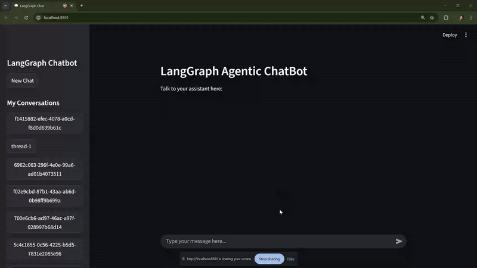

# 🧠 LangGraph Agentic ChatBot 

An intelligent **multi-tool conversational assistant** built using **LangGraph**, **LangChain**, and **Streamlit**.  
This chatbot can perform **web searches**, **calculations**, **weather updates**, **currency conversions**, and **stock lookups**, all while maintaining conversation history across sessions.  

---

## 🚀 Features  

- **Conversational Memory:** Saves chat history using SQLite checkpoints.  
- **Web Search:** Fetches live info using DuckDuckGo. 
- **Streaming Responses:** Assistant messages are streamed token-by-token for a more natural, real-time conversation experience.
- **Weather Updates:** Retrieves live weather data via OpenWeather API.  
- **Currency Conversion:** Converts between currencies using ExchangeRate API.  
- **Stock Prices:** Displays real-time stock quotes using Alpha Vantage.  
- **Math Calculator:** Performs basic arithmetic operations.  
- **Powered by Gemini:** Uses Google’s Gemini 2.5 Pro model for natural, context-aware replies.  
- **Interactive UI:** Built entirely with Streamlit for a smooth chat experience.  

---

## Tech Stack  

| Layer | Technology |
|-------|-------------|
| Frontend | Streamlit |
| Backend | LangGraph + LangChain |
| LLM | Google Gemini (via `langchain-google-genai`) |
| Database | SQLite (for conversation checkpointing) |
| APIs | DuckDuckGo, OpenWeather, ExchangeRate, AlphaVantage |
| Environment | Python 3.11 |

---

## 📂 Project Structure  

LangGraph_Agentic_Chatbot/

- streamlit_frontend_tool.py
- langgraph_backend_tool.py
- chatbot.db
- .env
- requirements.txt
- README.md

### 1️. Clone the Repository  
- git clone https://github.com/supra2001/LangGraph-Agentic-ChatBot.git
- cd LangGraph_Agentic_Chatbot 

### 2️. Create a Virtual Environment
- python -m venv venv
- venv\Scripts\activate     # On Windows
OR
- source venv/bin/activate  # On macOS/Linux

### 3️. Install Dependencies
- pip install -r requirements.txt

### 4️. Set Up Environment Variables
Create a file named .env in the project root:

- GOOGLE_API_KEY=your_google_api_key
- OPENWEATHER_API_KEY=your_openweather_api_key
- EXCHANGE_API_KEY=your_exchangerate_api_key

### 5. Run the Chatbot
- streamlit run streamlit_frontend_tool.py

---

### Persistent Memory

All chat threads are automatically saved in chatbot.db.
You can switch between conversations using the sidebar in Streamlit.

---

### Future Improvements

- Add voice input/output

- User authentication

- More complex tools (News, YouTube, Finance APIs)

- Deploy on Streamlit Cloud or Render

---

### Author

Supratim Mukherjee
- Data Science & AI Enthusiast
- email : supratim.2127@gmail.com